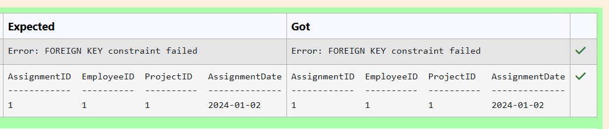
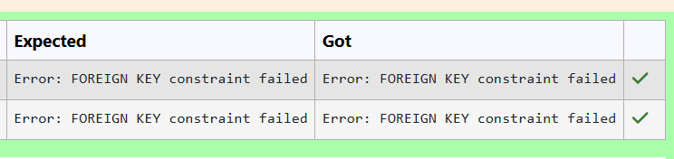
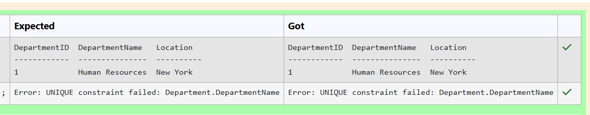
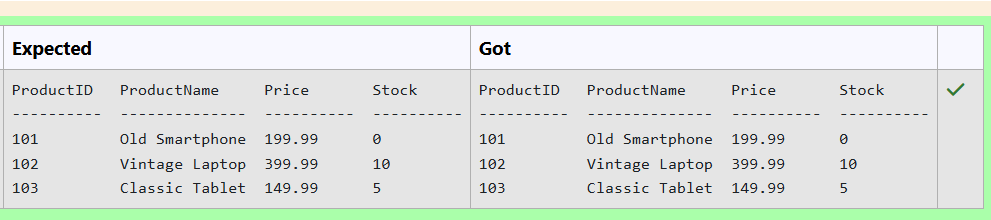
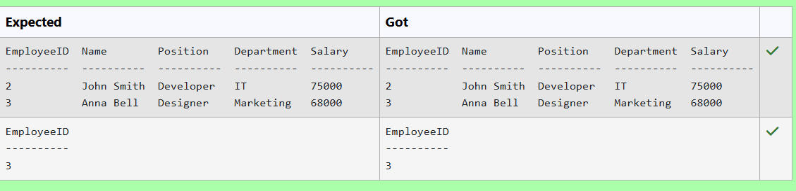
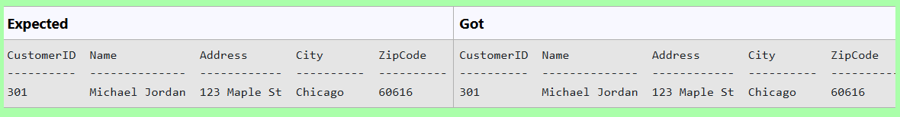
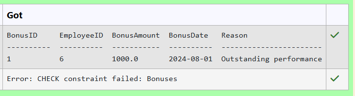
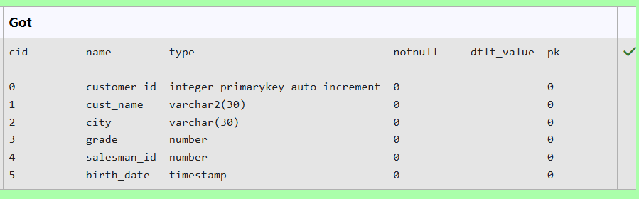
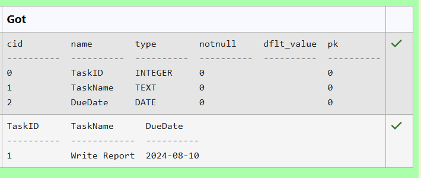

# Experiment 2: DDL Commands

## AIM
To study and implement DDL commands and different types of constraints.

## THEORY

### 1. CREATE
Used to create a new relation (table).

**Syntax:**
```sql
CREATE TABLE (
  field_1 data_type(size),
  field_2 data_type(size),
  ...
);
```
### 2. ALTER
Used to add, modify, drop, or rename fields in an existing relation.
(a) ADD
```sql
ALTER TABLE std ADD (Address CHAR(10));
```
(b) MODIFY
```sql
ALTER TABLE relation_name MODIFY (field_1 new_data_type(size));
```
(c) DROP
```sql
ALTER TABLE relation_name DROP COLUMN field_name;
```
(d) RENAME
```sql
ALTER TABLE relation_name RENAME COLUMN old_field_name TO new_field_name;
```
### 3. DROP TABLE
Used to permanently delete the structure and data of a table.
```sql
DROP TABLE relation_name;
```
### 4. RENAME
Used to rename an existing database object.
```sql
RENAME TABLE old_relation_name TO new_relation_name;
```
### CONSTRAINTS
Constraints are used to specify rules for the data in a table. If there is any violation between the constraint and the data action, the action is aborted by the constraint. It can be specified when the table is created (using CREATE TABLE) or after it is created (using ALTER TABLE).
### 1. NOT NULL
When a column is defined as NOT NULL, it becomes mandatory to enter a value in that column.
Syntax:
```sql
CREATE TABLE Table_Name (
  column_name data_type(size) NOT NULL
);
```
### 2. UNIQUE
Ensures that values in a column are unique.
Syntax:
```sql
CREATE TABLE Table_Name (
  column_name data_type(size) UNIQUE
);
```
### 3. CHECK
Specifies a condition that each row must satisfy.
Syntax:
```sql
CREATE TABLE Table_Name (
  column_name data_type(size) CHECK (logical_expression)
);
```
### 4. PRIMARY KEY
Used to uniquely identify each record in a table.
Properties:
Must contain unique values.
Cannot be null.
Should contain minimal fields.
Syntax:
```sql
CREATE TABLE Table_Name (
  column_name data_type(size) PRIMARY KEY
);
```
### 5. FOREIGN KEY
Used to reference the primary key of another table.
Syntax:
```sql
CREATE TABLE Table_Name (
  column_name data_type(size),
  FOREIGN KEY (column_name) REFERENCES other_table(column)
);
```
### 6. DEFAULT
Used to insert a default value into a column if no value is specified.

Syntax:
```sql
CREATE TABLE Table_Name (
  col_name1 data_type,
  col_name2 data_type,
  col_name3 data_type DEFAULT 'default_value'
);
```

**Question 1**
--
Create a table named ProjectAssignments with the following constraints:
* AssignmentID as INTEGER should be the primary key.
* EmployeeID as INTEGER should be a foreign key referencing Employees(EmployeeID).
* ProjectID as INTEGER should be a foreign key referencing Projects(ProjectID).
* AssignmentDate as DATE should be NOT NULL.

```sql
create table  ProjectAssignments(
    AssignmentID INTEGER primary Key,
    EmployeeID INTEGER,
    ProjectID INTEGER,
    AssignmentDate DATE NOT NULL,
    foreign key (EmployeeID) references Employees(EmployeeID),
    foreign key (ProjectID) references Projects(ProjectID)
)
```

**Output:**


**Question 2**
---
Create a table named Shipments with the following constraints:
* ShipmentID as INTEGER should be the primary key.
* ShipmentDate as DATE.
* SupplierID as INTEGER should be a foreign key referencing Suppliers(SupplierID).
* OrderID as INTEGER should be a foreign key referencing Orders(OrderID).

```sql
Create table Shipments (
  ShipmentID INTEGER Primary Key,
  ShipmentDate DATE,
  SupplierID INTEGER,
  OrderID INTEGER,
  foreign Key (SupplierID) references Suppliers(SupplierID),
  foreign Key (OrderID) references Orders(OrderID)
)
```

**Output:**



**Question 3**
---
Create a table named Department with the following constraints:
* DepartmentID as INTEGER should be the primary key.
* DepartmentName as TEXT should be unique and not NULL.
* Location as TEXT.

```sql
create table Department (
  DepartmentID INTEGER primary Key,
  DepartmentName TEXT unique not NULL,
  Location TEXT
);
```

**Output:**



**Question 4**
---
Insert all products from Discontinued_products into Products.

Table attributes are ProductID, ProductName, Price, Stock

```sql
insert into Products(ProductID, ProductName, Price, Stock) select ProductID, ProductName, Price, Stock from Discontinued_products;
```

**Output:**



**Question 5**
---
Insert the following employees into the Employee table:

<pre>EmployeeID  Name        Position    Department  Salary
----------  ----------  ----------  ----------  ----------
2           John Smith  Developer   IT          75000
3           Anna Bell   Designer    Marketing   68000
</pre>

```sql
insert into Employee (EmployeeID, Name, Position, Department, Salary) values (2,'John Smith' ,'Developer','IT', 75000),(3,'Anna Bell','Designer','Marketing',68000); 
```

**Output:**



**Question 6**
---
Write an SQL query to add a new column email of type TEXT to the Student_details table, and ensure that this column cannot contain NULL values and make default value as 'Invalid'

 

```sql
alter table Student_details add column email TEXT NOT NULL default 'Invalid';
```

**Output:**


**Question 7**
---
Insert a customer with CustomerID 301, Name Michael Jordan, Address 123 Maple St, City Chicago, and ZipCode 60616 into the Customers table.

```sql
Insert a customer with CustomerID 301, Name Michael Jordan, Address 123 Maple St, City Chicago, and ZipCode 60616 into the Customers table.
```

**Output:**



**Question 8**
---
Create a table named Bonuses with the following constraints:
* BonusID as INTEGER should be the primary key.
* EmployeeID as INTEGER should be a foreign key referencing Employees(EmployeeID).
* BonusAmount as REAL should be greater than 0.
* BonusDate as DATE.
* Reason as TEXT should not be NULL.

```sql
Create table Bonuses(
  BonusID INTEGER primary Key,
  EmployeeID INTEGER ,
  BonusAmount REAL check (BonusAmount>0),
  BonusDate DATE,
  Reason TEXT NOT NULL,
  foreign key (EmployeeID) references Employees(EmployeeID)
);
```

**Output:**



**Question 9**
---
Write a SQL query to add birth_date attribute as timestamp (datatype) in the table customer 

Sample table: customer
<pre>
 customer_id |   cust_name    |    city    | grade | salesman_id 
-------------+----------------+------------+-------+-------------
        3002 | Nick Rimando   | New York   |   100 |        5001
        3007 | Brad Davis     | New York   |   200 |        5001
        3005 | Graham Zusi    | California |   200 |        5002
</pre>
```sql
alter table customer add column birth_date timestamp;
```

**Output:**



**Question 10**
---
Create a table named Tasks with the following columns:

* TaskID as INTEGER
* TaskName as TEXT
* DueDate as DATE

```sql
Create table Tasks (
  TaskID INTEGER,
  TaskName TEXT,
  DueDate DATE
);
```

**Output:**




## RESULT
Thus, the SQL queries to implement different types of constraints and DDL commands have been executed successfully.
