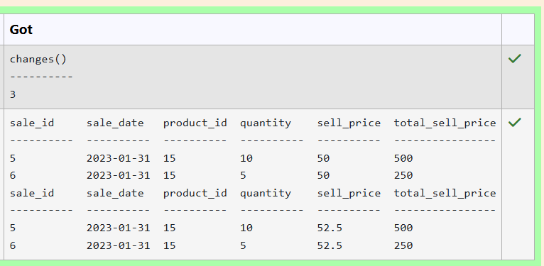
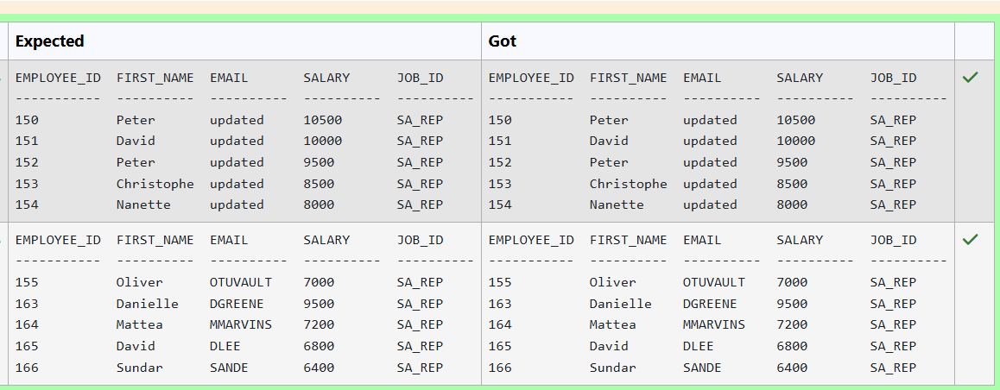
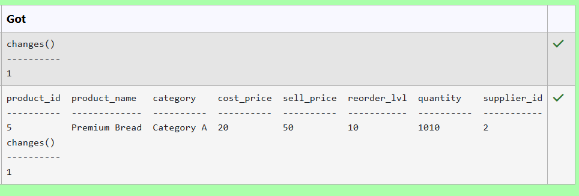
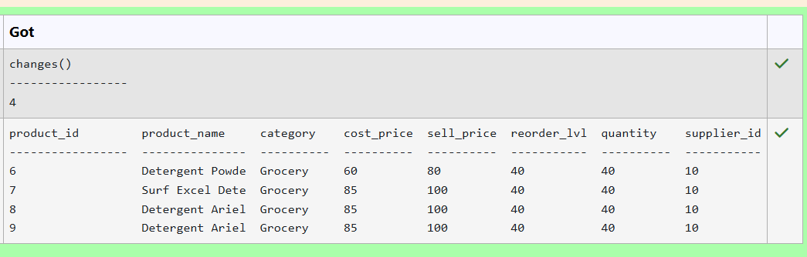
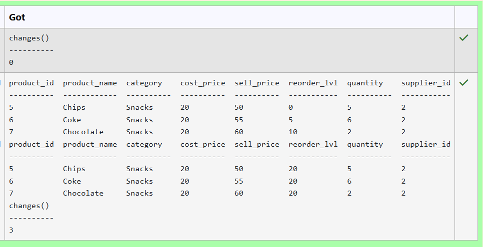
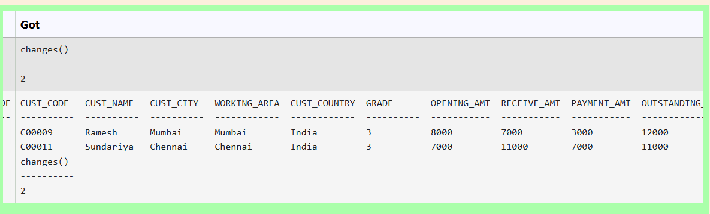
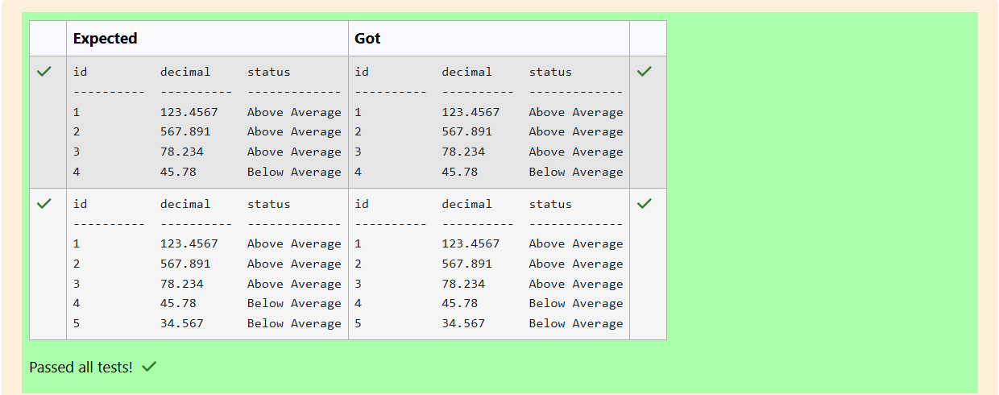
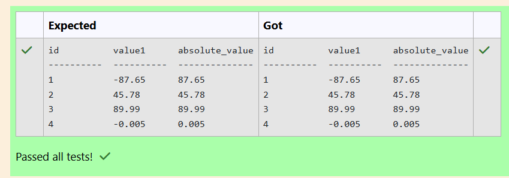
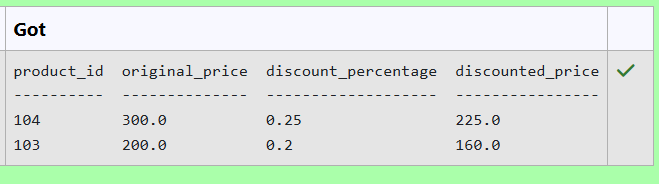
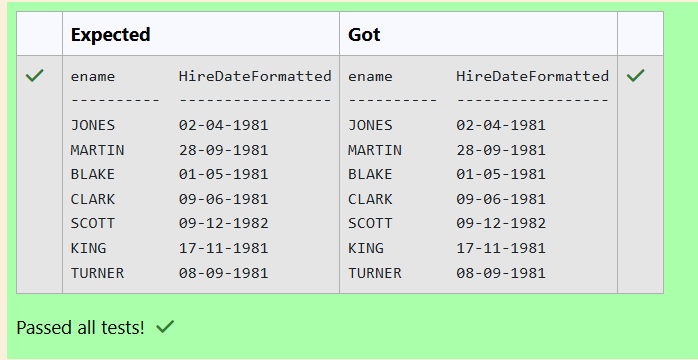

# Experiment 3: DML Commands

## AIM
To study and implement DML (Data Manipulation Language) commands.

## THEORY

### 1. INSERT INTO
Used to add records into a relation.
These are three type of INSERT INTO queries which are as
A)Inserting a single record
**Syntax (Single Row):**
```sql
INSERT INTO table_name (field_1, field_2, ...) VALUES (value_1, value_2, ...);
```
**Syntax (Multiple Rows):**
```sql
INSERT INTO table_name (field_1, field_2, ...) VALUES
(value_1, value_2, ...),
(value_3, value_4, ...);
```
**Syntax (Insert from another table):**
```sql
INSERT INTO table_name SELECT * FROM other_table WHERE condition;
```
### 2. UPDATE
Used to modify records in a relation.
Syntax:
```sql
UPDATE table_name SET column1 = value1, column2 = value2 WHERE condition;
```
### 3. DELETE
Used to delete records from a relation.
**Syntax (All rows):**
```sql
DELETE FROM table_name;
```
**Syntax (Specific condition):**
```sql
DELETE FROM table_name WHERE condition;
```
### 4. SELECT
Used to retrieve records from a table.
**Syntax:**
```sql
SELECT column1, column2 FROM table_name WHERE condition;
```
**Question 1**
--
Write a SQL statement to Increase the selling price per unit by 5% for product ID 15 who's sale is on '2023-01-31'.

sales(sale_id,sale_date,product_id,quantity,sell_price,total_sell_price)

```sql
update sales set sell_price=sell_price*1.05 where product_id=15 and sale_date='2023-01-31';
```

**Output:**



**Question 2**
---
Write a SQL statement to Increase the salary by 500 and email as 'updated' for employees with job ID 'SA_REP' and commission percentage greater than 0.15

Employees table

---------------
<pre>employee_id
first_name
last_name
email
phone_number
hire_date
job_id
salary
commission_pct
manager_id
department_id
</pre>

```sql
update employees set salary=salary+500,email='updated' where job_id='SA_REP' AND commission_pct>0.15;
```

**Output:**



**Question 3**
---
Write a SQL statement to Update the product_name to 'Premium Bread' whose product ID is 5 in the products table.

Products table

---------------
<pre>
product_id
product_name
category
cost_price
sell_price
reorder_lvl
quantity
supplier_id
</pre>

```sql
update Products set product_name='Premium Bread' where product_id=5;
```

**Output:**



**Question 4**
---
Update the reorder level to 40 pieces for all products belonging to the 'Grocery' category in the products table.

PRODUCTS TABLE
<pre>
name               type
-----------------  ---------------
product_id         INT
product_name       VARCHAR(100)
category           VARCHAR(50)
cost_price         DECIMAL(10,2)
sell_price         DECIMAL(10,2)
reorder_lvl        INT
quantity           INT
supplier_id        INT
</pre>
```sql
update PRODUCTS set reorder_lvl=40 where category='Grocery';
```

**Output:**



**Question 5**
---
Write a SQL statement to Update the reorder level to 20 where the quantity in stock is less than 10 and product category is 'Snacks' in the products table.

Products table

---------------
<pre>
product_id
product_name
category
cost_price
sell_price
reorder_lvl
quantity
supplier_id
</pre>

```sql
update Products set reorder_lvl=20 where quantity<10 and category='Snacks';
```

**Output:**



**Question 6**
---
Write a SQL query to Delete customers with following conditions

1.'CUST_COUNTRY' is not in a list of specified countries ('UK', 'USA', 'Canada')
2.'GRADE' is greater than or equal to 3
Sample table: Customer
<pre>
+-----------+-------------+-------------+--------------+--------------+-------+-------------+-------------+-------------+---------------+--------------+------------+  
|CUST_CODE  | CUST_NAME   | CUST_CITY   | WORKING_AREA | CUST_COUNTRY | GRADE | OPENING_AMT | RECEIVE_AMT | PAYMENT_AMT |OUTSTANDING_AMT| PHONE_NO     | AGENT_CODE |
+-----------+-------------+-------------+--------------+--------------+-------+-------------+-------------+-------------+---------------+--------------+------------+
| C00013    | Holmes      | London      | London       | UK           |     2 |     6000.00 |     5000.00 |     7000.00 |       4000.00 | BBBBBBB      | A003       |
| C00001    | Micheal     | New York    | New York     | USA          |     2 |     3000.00 |     5000.00 |     2000.00 |       6000.00 | CCCCCCC      | A008       |
| C00020    | Albert      | New York    | New York     | USA          |     3 |     5000.00 |     7000.00 |     6000.00 |       6000.00 | BBBBSBB      | A008       |
</pre>
```sql
DELETE FROM customer where CUST_COUNTRY NOT IN ('UK','USA','Canada') AND GRADE >= 3;
```

**Output:**



**Question 7**
---
Write a SQL query to determine the status of decimal in the Calculations table as 'Below Average', 'Average', or 'Above Average' based on whether it is below 50, exactly 50, or above 50.
<pre>
cid         name        type        notnull     dflt_value  pk
----------  ----------  ----------  ----------  ----------  ----------
0           id          INTEGER     0                       1
1           value1      REAL        0                       0
2           value2      REAL        0                       0
3           base        INTEGER     0                       0
4           exponent    INTEGER     0                       0
5           number      REAL        0                       0
6           decimal     REAL        0                       0
</pre> 

```sql
SELECT id,decimal,
CASE WHEN decimal < 50 THEN 'Below Average'
WHEN decimal = 50 THEN 'Average'
WHEN decimal >50 THEN 'Above Average'
END AS status FROM Calculations;
```

**Output:**



**Question 8**
---
Write a SQL query to calculate the absolute value of the value1 column from the Calculations table.
<pre>
cid         name        type        notnull     dflt_value  pk
----------  ----------  ----------  ----------  ----------  ----------
0           id          INTEGER     0                       1
1           value1      REAL        0                       0
2           value2      REAL        0                       0
3           base        INTEGER     0                       0
4           exponent    INTEGER     0                       0
5           number      REAL        0                       0
6           decimal     REAL        0                       0
</pre> 

```sql
SELECT id,value1 ,ABS(value1) AS absolute_value FROM calculations;
```

**Output:**



**Question 9**
---
Write a query to find the top 2 products with the highest discount percentage. Return product_id, original_price, discount_percentage, and discounted_price.

Sample table: Products
<pre>
product_id | original_price | discount_percentage

-----------------------------------------------------------

"101" "50" "0.1"

"102" "150" "0.15"

"103" "200" "0.2"

"104" "300" "0.25"
</pre>

```sql
SELECT product_id,original_price ,discount_percentage,(original_price-(original_price*discount_percentage)) AS discounted_price FROM Products ORDER BY discount_percentage DESC LIMIT 2;
```

**Output:**



**Question 10**
---
Write a SQL query to display hire dates in the format "DD-MM-YYYY" from the emp table
<pre>
cid         name        type        
----------  ----------  ---------- 
0           empno       INT         
1           ename       VARCHAR(100)
2           job         VARCHAR(50)
3           mgr         INT        
4           hiredate    DATE        
5           sal         DECIMAL(10,2)  
6           comm        DECIMAL(10,2)  
7           deptno      INT     
</pre>
```sql
SELECT ename,strftime('%d-%m-%Y',hiredate) AS HireDateFormatted FROM emp;
```

**Output:**


## RESULT
Thus, the SQL queries to implement DML commands have been executed successfully.
