# Experiment 4: Aggregate Functions, Group By and Having Clause

## AIM
To study and implement aggregate functions, GROUP BY, and HAVING clause with suitable examples.

## THEORY

### Aggregate Functions
These perform calculations on a set of values and return a single value.

- **MIN()** – Smallest value  
- **MAX()** – Largest value  
- **COUNT()** – Number of rows  
- **SUM()** – Total of values  
- **AVG()** – Average of values

**Syntax:**
```sql
SELECT AGG_FUNC(column_name) FROM table_name WHERE condition;
```
### GROUP BY
Groups records with the same values in specified columns.
**Syntax:**
```sql
SELECT column_name, AGG_FUNC(column_name)
FROM table_name
GROUP BY column_name;
```
### HAVING
Filters the grouped records based on aggregate conditions.
**Syntax:**
```sql
SELECT column_name, AGG_FUNC(column_name)
FROM table_name
GROUP BY column_name
HAVING condition;
```

**Question 1**
--
How many medical records were created in each month?

Sample table:MedicalRecords Table


```sql
select 
STRFTIME('%Y-%m',Date) AS Month,
COUNT(*) AS TotalRecords 
From MedicalRecords GROUP BY Month ORDER BY Month;
```

**Output:**

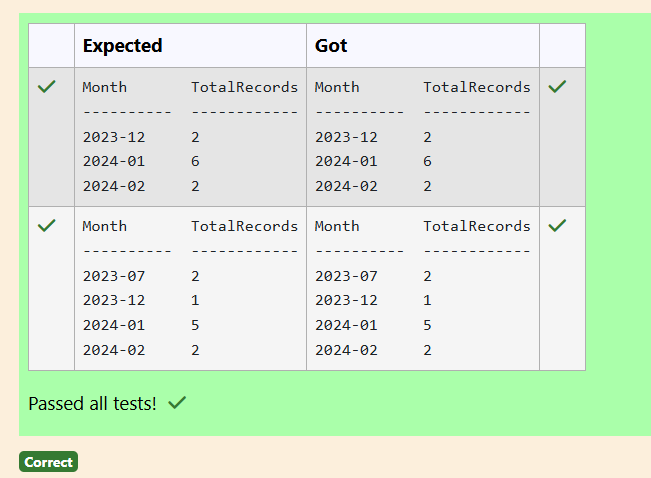

**Question 2**
---
How many patients are there in each city?

Sample table: Patients Table
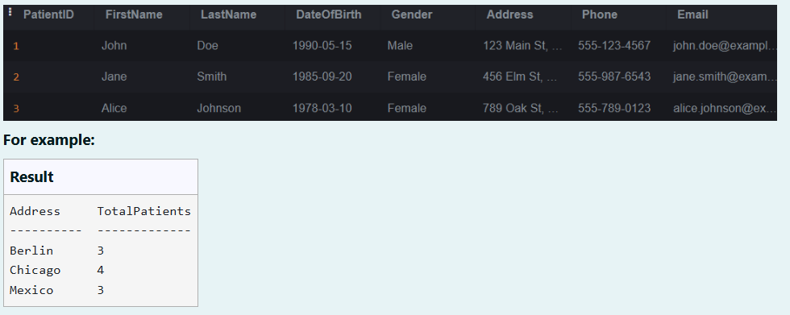
```sql
SELECT Address, COUNT(*) AS TotalPatients
FROM Patients
GROUP BY Address;
```

**Output:**

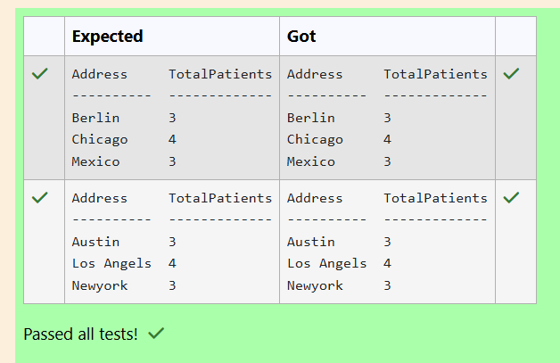

**Question 3**
---
Write SQL query to extract the email domain from each patient's email address and count the number of patients with the same email domain.

Sample table: Patients Table
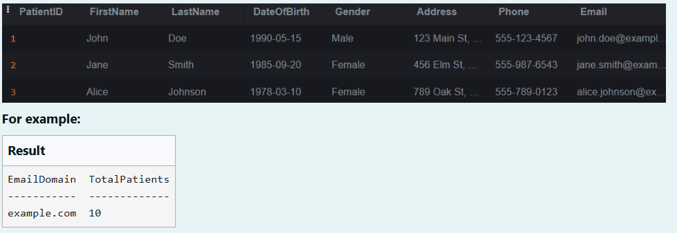
```sql
SELECT SUBSTR(Email,INSTR(Email,'@')+1) AS EmailDomain, COUNT(*) AS TotalPatients FROM Patients GROUP BY EmailDomain;
```

**Output:**


**Question 4**
---
Write a SQL query to Calculate the average email length (in characters) for people who lives in Mumbai city

Table: customer
<pre>
name        type
----------  ----------
id          INTEGER
name        TEXT   
city        TEXT
email       TEXT
phone       INTEGER
</pre>
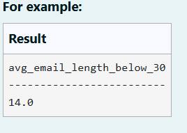
```sql
SELECT AVG(LENGTH(email)) AS avg_email_length_below_30  FROM customer WHERE city='Mumbai';
```

**Output:**

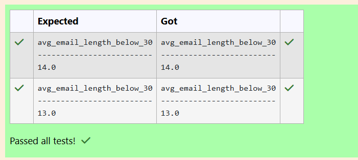

**Question 5**
---
Write a SQL query to  find the average salary of all employees?

Table: employee
<pre>
name        type
----------  ----------
id          INTEGER
name        TEXT
age         INTEGER
city        TEXT
income      INTEGER
</pre>
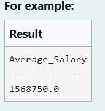
```sql
SELECT AVG(income) AS Average_Salary FROM employee;
```

**Output:**

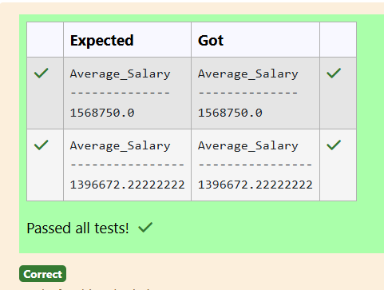

**Question 6**
---
Write a SQL query to find the total amount of fruits with a unit type of 'LB'.

Note: Inventory attribute contains amount of fruits

Table: fruits
<pre>
name        type
----------  ----------
id          INTEGER
name        TEXT
unit        TEXT
inventory   INTEGER
price       REAL
 </pre>
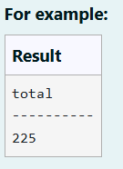
```sql
SELECT SUM(inventory) AS total FROM fruits WHERE unit='LB';
```

**Output:**

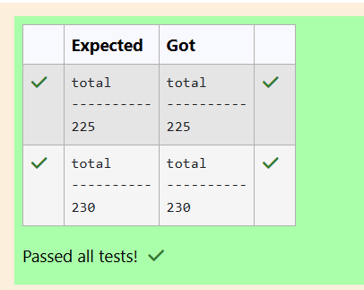
**Question 7**
---
Write a SQL query to find What is the age difference between the youngest and oldest employee in the company.

Table: employee
<pre>
name        type
----------  ----------
id          INTEGER
name        TEXT
age         INTEGER
city        TEXT
income      INTEGER
</pre>
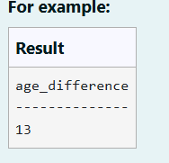
```sql
SELECT MAX(age)-MIN(age) AS age_difference FROM employee;
```

**Output:**

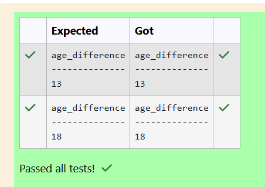

**Question 8**
---
Write the SQL query that achieves the selection of category and calculates the sum of the product of price and category ID as Revenue for each category from the "products" table, and includes only those products where the total revenue is greater than 25.

Sample table: products
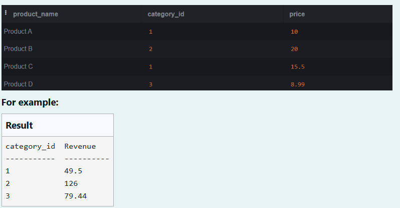

```sql
SELECT category_id,
SUM(price*category_id) AS Revenue FROM products
GROUP BY category_id
HAVING Revenue>25;
```

**Output:**

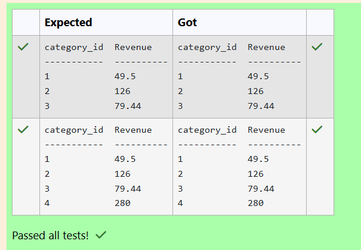

**Question 9**
---
Write the SQL query that achieves the grouping of data by occupation, calculates the total work hours for each occupation, and excludes occupations where the total work hour sum is not greater than 20.

Sample table: employee1
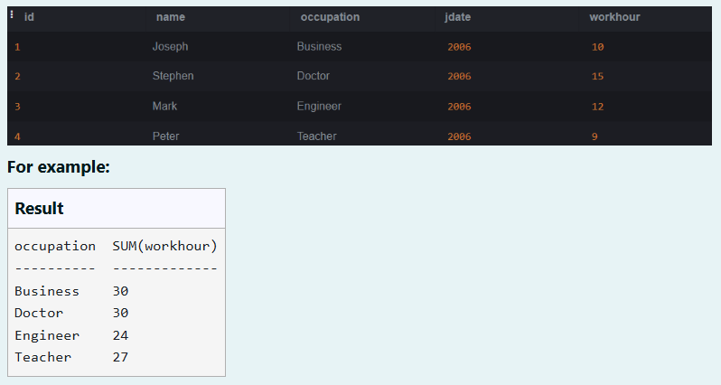

```sql
SELECT occupation,SUM(workhour) 
FROM employee1
GROUP BY occupation HAVING SUM(workhour)>20;
```

**Output:**

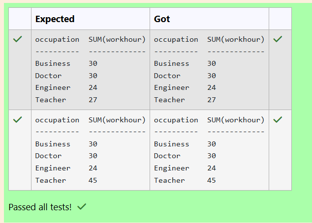

**Question 10**
---
Write the SQL query that achieves the grouping of data by city, calculates the total income for each city, and includes only those cities where the total income sum is greater than 200,000.

Sample table: employee
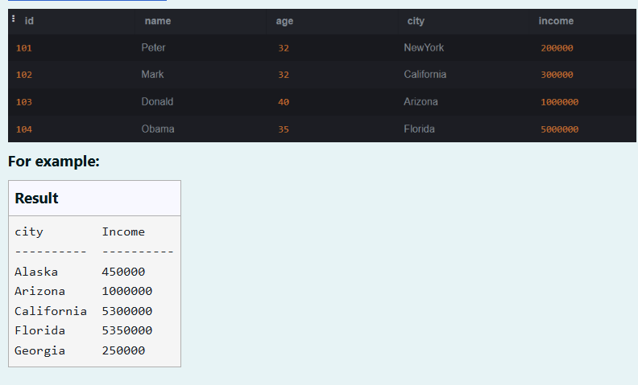
```sql
SELECT city, SUM(income) AS Income FROM employee
GROUP BY city
HAVING SUM(income)>200000;
```

**Output:**
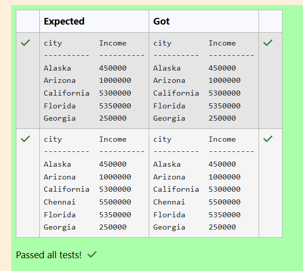

## RESULT
Thus, the SQL queries to implement aggregate functions, GROUP BY, and HAVING clause have been executed successfully.
