# Experiment 5: Subqueries and Views

## AIM
To study and implement subqueries and views.

## THEORY

### Subqueries
A subquery is a query inside another SQL query and is embedded in:
- WHERE clause
- HAVING clause
- FROM clause

**Types:**
- **Single-row subquery**:
  Sub queries can also return more than one value. Such results should be made use along with the operators in and any.
- **Multiple-row subquery**:
  Here more than one subquery is used. These multiple sub queries are combined by means of ‘and’ & ‘or’ keywords.
- **Correlated subquery**:
  A subquery is evaluated once for the entire parent statement whereas a correlated Sub query is evaluated once per row processed by the parent statement.

**Example:**
```sql
SELECT * FROM employees
WHERE salary > (SELECT AVG(salary) FROM employees);
```
### Views
A view is a virtual table based on the result of an SQL SELECT query.
**Create View:**
```sql
CREATE VIEW view_name AS
SELECT column1, column2 FROM table_name WHERE condition;
```
**Drop View:**
```sql
DROP VIEW view_name;
```

**Question 1**
--
From the following tables, write a SQL query to find those salespeople who earned the maximum commission. Return ord_no, purch_amt, ord_date, and salesman_id.

salesman table
<pre>
name             type
---------------  ---------------
salesman_id      numeric(5)
name                 varchar(30)
city                    varchar(15)
commission       decimal(5,2)
</pre>
orders table
<pre>
name             type
---------------  --------
order_no         int
purch_amt        real
order_date       text
customer_id      int
salesman_id      int
</pre>
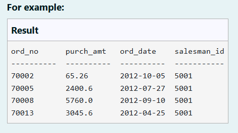
```sql
SELECT o.ord_no, o.purch_amt, o.ord_date, o.salesman_id
FROM orders o
JOIN salesman s ON o.salesman_id = s.salesman_id
WHERE s.commission = (
    SELECT MAX(commission)
    FROM salesman
);

```

**Output:**

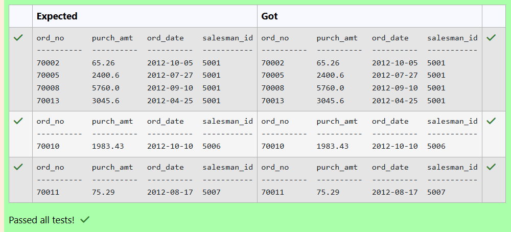

**Question 2**
---
Write a query to display all the customers whose ID is the difference between the salesperson ID of Mc Lyon and 2001.

salesman table
<pre>
name             type
---------------  ---------------
salesman_id      numeric(5)
name                 varchar(30)
city                    varchar(15)
commission       decimal(5,2)
</pre>
customer table
<pre>
name         type
-----------  ----------
customer_id  int
cust_name    text
city         text
grade        int
salesman_id  int
</pre>
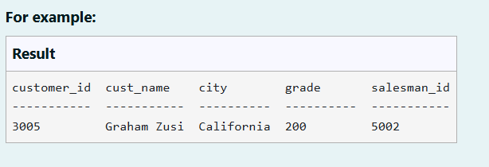
```sql
SELECT c.customer_id, c.cust_name, c.city, c.grade, c.salesman_id
FROM customer c
WHERE c.customer_id = (
    SELECT s.salesman_id - 2001
    FROM salesman s
    WHERE s.name = 'Mc Lyon'
);

```

**Output:**

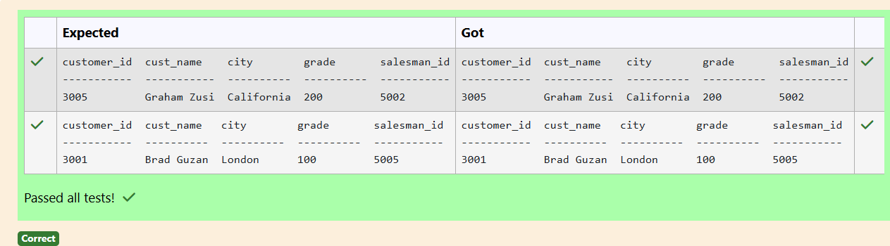

**Question 3**
---
Write a SQL query to retrieve all columns from the CUSTOMERS table for customers whose salary is greater than $4500.

Sample table: CUSTOMERS
<pre>
ID          NAME        AGE         ADDRESS     SALARY
----------  ----------  ----------  ----------  ----------

1          Ramesh       32             Ahmedabad     2000
2          Khilan       25             Delhi         1500
3          Kaushik      23             Kota          2000
4          Chaitali     25             Mumbai        6500
5          Hardik       27             Bhopal        8500
6          Komal        22             Hyderabad     4500
7          Muffy        24             Indore        10000
</pre>
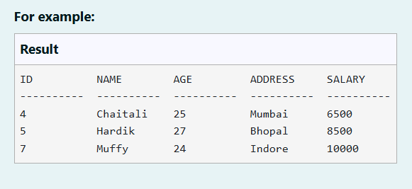
```sql
SELECT *
FROM CUSTOMERS
WHERE SALARY > 4500;

```

**Output:**

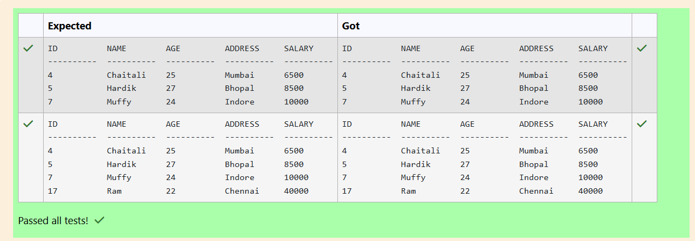

**Question 4**
---
Write a SQL query that retrieves the names of students and their corresponding grades, where the grade is equal to the maximum grade achieved in each subject.

Sample table: GRADES (attributes: student_id, student_name, subject, grade)

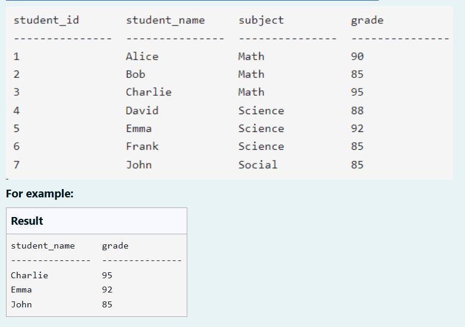
```sql
SELECT student_name, grade
FROM GRADES g
WHERE grade = (
    SELECT MAX(grade)
    FROM GRADES
    WHERE subject = g.subject
);

```

**Output:**

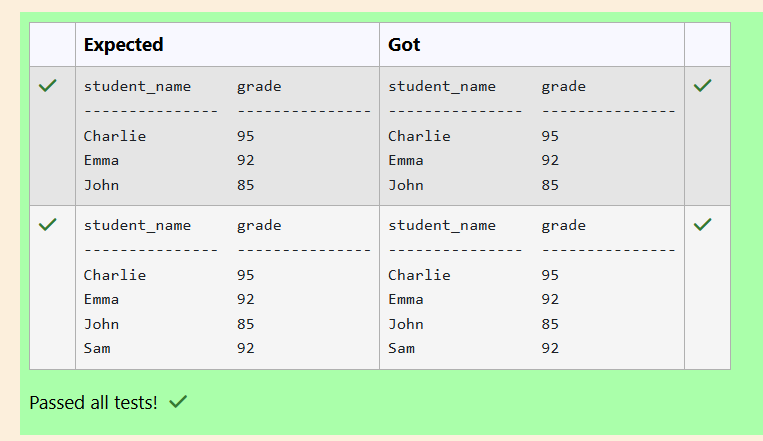

**Question 5**
---
Write a SQL query to retrieve all columns from the CUSTOMERS table for customers whose salary is EQUAL TO $1500.

Sample table: CUSTOMERS
<pre>
ID          NAME        AGE         ADDRESS     SALARY
----------  ----------  ----------  ----------  ----------

1          Ramesh       32             Ahmedabad     2000
2          Khilan       25             Delhi         1500
3          Kaushik      23             Kota          2000
4          Chaitali     25             Mumbai        6500
5          Hardik       27             Bhopal        8500
6          Komal        22             Hyderabad     4500
7          Muffy        24             Indore        10000
</pre>

```sql
SELECT *
FROM CUSTOMERS
WHERE SALARY = 1500;

```

**Output:**

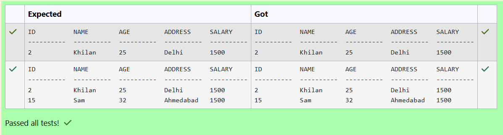

**Question 6**
---
Write a SQL query to retrieve all columns from the CUSTOMERS table for customers whose salary is greater than $1500.

Sample table: CUSTOMERS
<pre>
ID          NAME        AGE         ADDRESS     SALARY
----------  ----------  ----------  ----------  ----------

1          Ramesh       32            Ahmedabad   2000
2          Khilan       25            Delhi       1500
3          Kaushik      23            Kota        2000
4          Chaitali     25            Mumbai      6500
5          Hardik       27            Bhopal      8500
6          Komal        22            Hyderabad   4500
7          Muffy        24            Indore      10000
</pre>
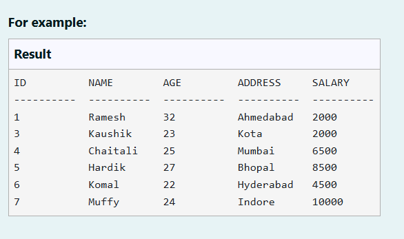
```sql
SELECT *
FROM CUSTOMERS
WHERE SALARY > 1500;

```

**Output:**

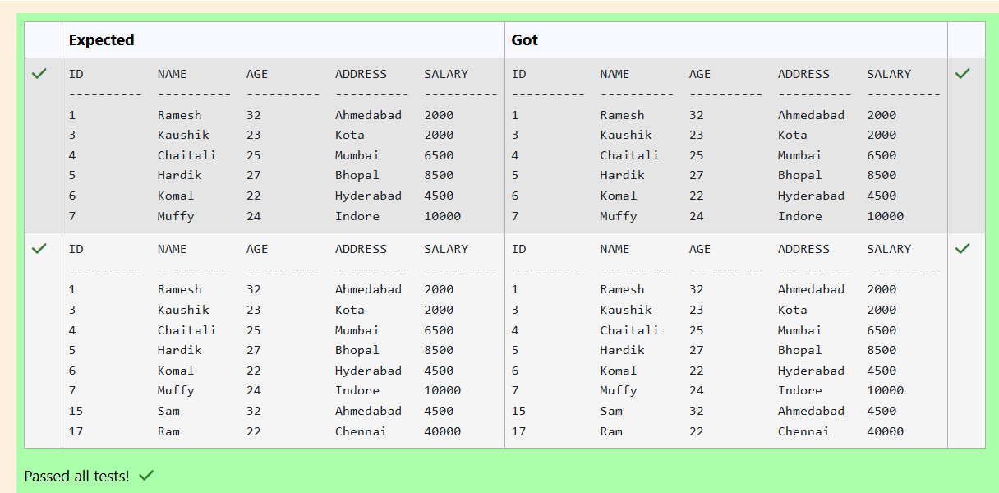

**Question 7**
---
From the following tables write a SQL query to find all orders generated by New York-based salespeople. Return ord_no, purch_amt, ord_date, customer_id, salesman_id.

salesman table
<pre>
name             type
---------------  ---------------
salesman_id      numeric(5)
name                 varchar(30)
city                    varchar(15)
commission       decimal(5,2)
</pre>
orders table
<pre>
name             type
---------------  --------
order_no         int
purch_amt        real
order_date       text
customer_id      int
salesman_id      int
</pre>
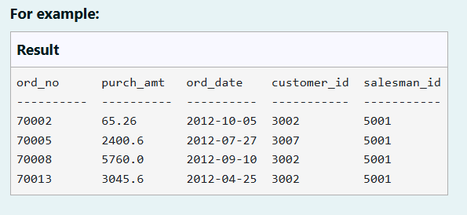
```sql
SELECT o.ord_no, o.purch_amt, o.ord_date, o.customer_id, o.salesman_id
FROM orders o
JOIN salesman s ON o.salesman_id = s.salesman_id
WHERE s.city = 'New York';

```

**Output:**

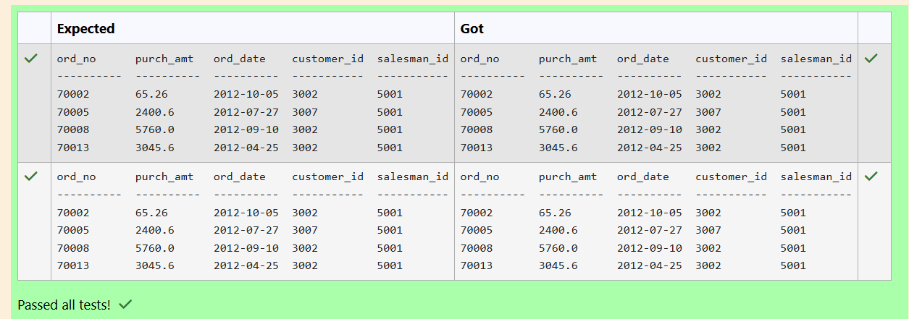

**Question 8**
---
From the following tables write a SQL query to find all orders generated by London-based salespeople. Return ord_no, purch_amt, ord_date, customer_id, salesman_id.

salesman table
<pre>
name             type
---------------  ---------------
salesman_id      numeric(5)
name                 varchar(30)
city                    varchar(15)
commission       decimal(5,2)
</pre>
orders table
<pre>
name             type
---------------  --------
order_no         int
purch_amt        real
order_date       text
customer_id      int
salesman_id      int
</pre>

```sql
SELECT o.ord_no, o.purch_amt, o.ord_date, o.customer_id, o.salesman_id
FROM orders o
JOIN salesman s ON o.salesman_id = s.salesman_id
WHERE s.city = 'London';

```

**Output:**

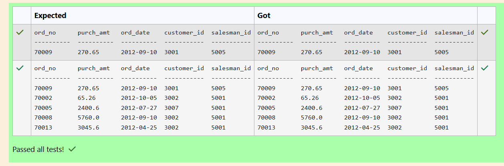

**Question 9**
---
From the following tables, write a SQL query to find all the orders issued by the salesman 'Paul Adam'. Return ord_no, purch_amt, ord_date, customer_id and salesman_id.

salesman table
<pre>
name             type
---------------  ---------------
salesman_id      numeric(5)
name                 varchar(30)
city                    varchar(15)
commission       decimal(5,2)
</pre>
orders table

<pre>
name             type
---------------  --------
order_no         int
purch_amt        real
order_date       text
customer_id      int
salesman_id      int
</pre>
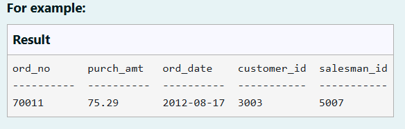
```sql
SELECT o.ord_no, o.purch_amt, o.ord_date, o.customer_id, o.salesman_id
FROM orders o
JOIN salesman s ON o.salesman_id = s.salesman_id
WHERE s.name = 'Paul Adam';

```

**Output:**

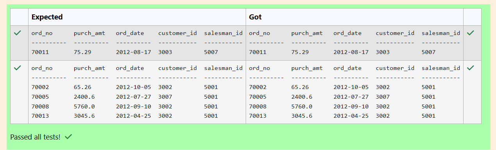

**Question 10**
---
Write a SQL query to Retrieve the medications with dosages equal to the highest dosage

Table Name: Medications (attributes: medication_id, medication_name, dosage)
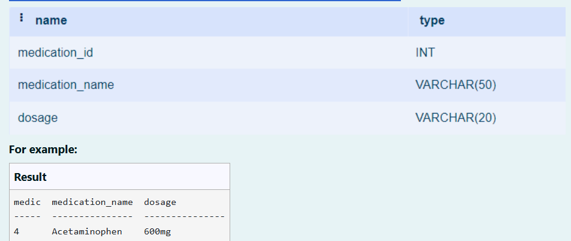

```sql
SELECT 
    medication_id,
    medication_name,
    dosage
FROM 
    Medications
WHERE 
    dosage = (
        SELECT 
            MAX(dosage)
        FROM 
            Medications
    );

```

**Output:**
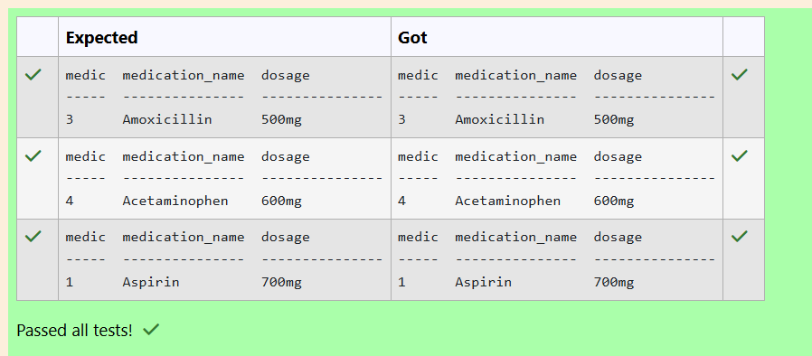


## RESULT
Thus, the SQL queries to implement subqueries and views have been executed successfully.
