# Experiment 6: Joins

## AIM
To study and implement different types of joins.

## THEORY

SQL Joins are used to combine records from two or more tables based on a related column.

### 1. INNER JOIN
Returns records with matching values in both tables.

**Syntax:**
```sql
SELECT columns
FROM table1
INNER JOIN table2
ON table1.column = table2.column;
```

### 2. LEFT JOIN
Returns all records from the left table, and matched records from the right.

**Syntax:**

```sql
SELECT columns
FROM table1
LEFT JOIN table2
ON table1.column = table2.column;
```
### 3. RIGHT JOIN
Returns all records from the right table, and matched records from the left.

**Syntax:**

```sql
SELECT columns
FROM table1
RIGHT JOIN table2
ON table1.column = table2.column;
```
### 4. FULL OUTER JOIN
Returns all records when there is a match in either left or right table.

**Syntax:**

```sql
SELECT columns
FROM table1
FULL OUTER JOIN table2
ON table1.column = table2.column;
```

**Question 1**
--
From the following tables write a SQL query to display the customer name, customer city, grade, salesman, salesman city. The results should be sorted by ascending customer_id.  

Sample table: customer
<pre>
 customer_id |   cust_name    |    city    | grade | salesman_id 
-------------+----------------+------------+-------+-------------
        3002 | Nick Rimando   | New York   |   100 |        5001
        3007 | Brad Davis     | New York   |   200 |        5001
        3005 | Graham Zusi    | California |   200 |        5002
        3008 | Julian Green   | London     |   300 |        5002
        3004 | Fabian Johnson | Paris      |   300 |        5006
        3009 | Geoff Cameron  | Berlin     |   100 |        5003
        3003 | Jozy Altidor   | Moscow     |   200 |        5007
        3001 | Brad Guzan     | London     |       |        5005
</pre>
Sample table: salesman
<pre>
 salesman_id |    name    |   city   | commission 
-------------+------------+----------+------------
        5001 | James Hoog | New York |       0.15
        5002 | Nail Knite | Paris    |       0.13
        5005 | Pit Alex   | London   |       0.11
        5006 | Mc Lyon    | Paris    |       0.14
        5007 | Paul Adam  | Rome     |       0.13
        5003 | Lauson Hen | San Jose |       0.12
</pre>

```sql
SELECT 
    customer.cust_name, 
    customer.city, 
    customer.grade, 
    salesman.name AS Salesman, 
    salesman.city AS city
FROM 
    customer
JOIN 
    salesman 
ON 
    customer.salesman_id = salesman.salesman_id
ORDER BY 
    customer.customer_id ASC;

```

**Output:**

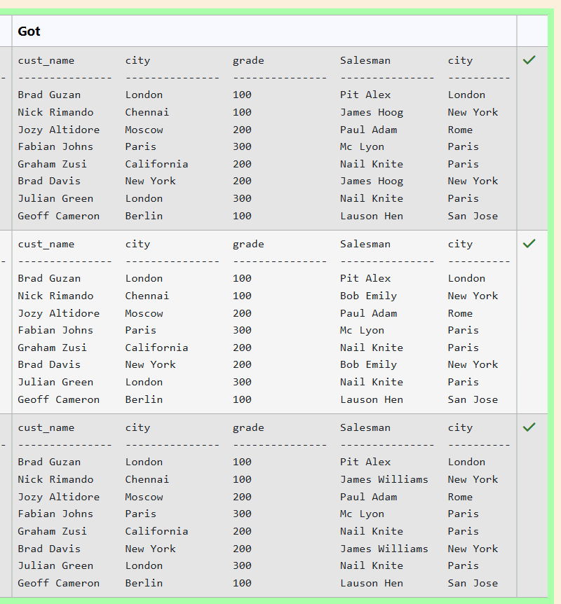

**Question 2**
---
From the following tables write a SQL query to find those customers with a grade less than 300. Return cust_name, customer city, grade, Salesman, salesmancity. The result should be ordered by ascending customer_id. 

Sample table: customer
<pre>
 customer_id |   cust_name    |    city    | grade | salesman_id 
-------------+----------------+------------+-------+-------------
        3002 | Nick Rimando   | New York   |   100 |        5001
        3007 | Brad Davis     | New York   |   200 |        5001
        3005 | Graham Zusi    | California |   200 |        5002
        3008 | Julian Green   | London     |   300 |        5002
        3004 | Fabian Johnson | Paris      |   300 |        5006
        3009 | Geoff Cameron  | Berlin     |   100 |        5003
        3003 | Jozy Altidor   | Moscow     |   200 |        5007
        3001 | Brad Guzan     | London     |       |        5005
</pre>
Sample table: salesman
<pre>
 salesman_id |    name    |   city   | commission 
-------------+------------+----------+------------
        5001 | James Hoog | New York |       0.15
        5002 | Nail Knite | Paris    |       0.13
        5005 | Pit Alex   | London   |       0.11
        5006 | Mc Lyon    | Paris    |       0.14
        5007 | Paul Adam  | Rome     |       0.13
        5003 | Lauson Hen | San Jose |       0.12
</pre>
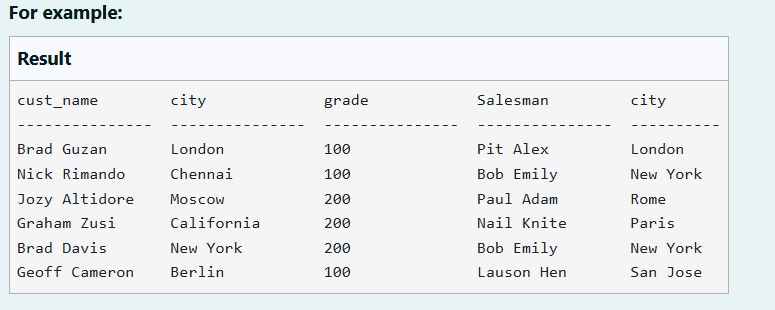
```sql
SELECT 
    customer.cust_name, 
    customer.city, 
    customer.grade, 
    salesman.name AS Salesman, 
    salesman.city AS city
FROM 
    customer
JOIN 
    salesman 
ON 
    customer.salesman_id = salesman.salesman_id
WHERE 
    customer.grade < 300
ORDER BY 
    customer.customer_id ASC;

```

**Output:**

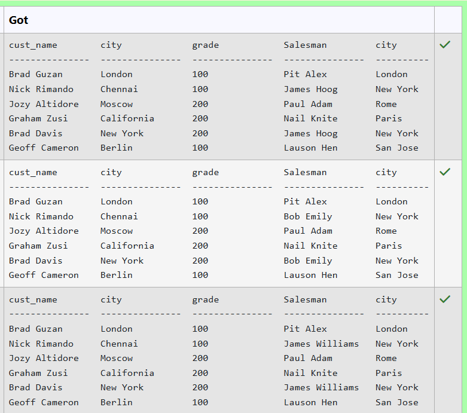

**Question 3**
---
Write the SQL query that achieves the selection of the first name from the "patients" table (aliased as "patient_name") and the first name from the "doctors" table (aliased as "doctor_name"), with an inner join on the "doctor_id" column and a condition filtering for patients with a date of birth after '1990-01-01'.

PATIENTS TABLE:

ATTRIBUTES - patient_id, first_name, last_name, date_of_birth, admission_date, discharge_date, doctor_id

DOCTORS TABLE:

ATTRIBUTES - doctor_id, first_name, last_name, specialization
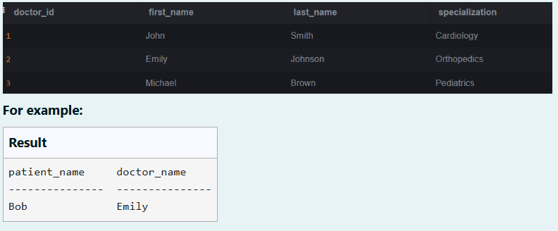

```sql
SELECT 
    patients.first_name AS patient_name,
    doctors.first_name AS doctor_name
FROM 
    patients
INNER JOIN 
    doctors 
ON 
    patients.doctor_id = doctors.doctor_id
WHERE 
    patients.date_of_birth > '1990-01-01';

```

**Output:**

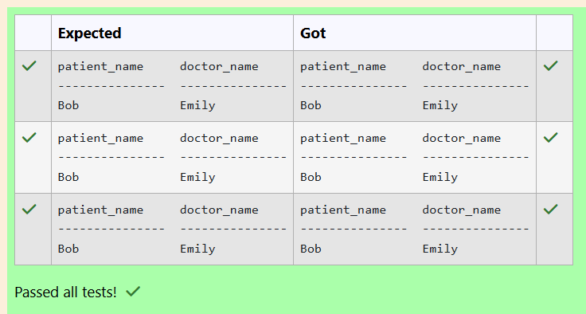
**Question 4**
---
Write the SQL query that achieves the selection of the date of birth from the "patients" table (aliased as "p") and all columns from the "appointments" table (aliased as "a"), with an inner join on the "patient_id" column and a condition filtering for patients with the first name 'Alice'.
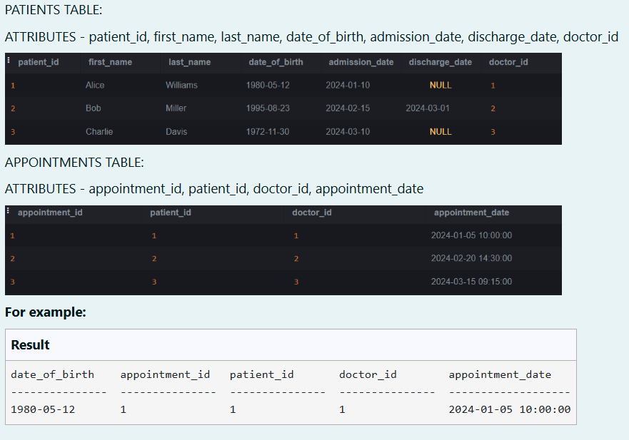

```sql
SELECT 
    p.date_of_birth, 
    a.*
FROM 
    patients AS p
INNER JOIN 
    appointments AS a 
ON 
    p.patient_id = a.patient_id
WHERE 
    p.first_name = 'Alice';

```

**Output:**

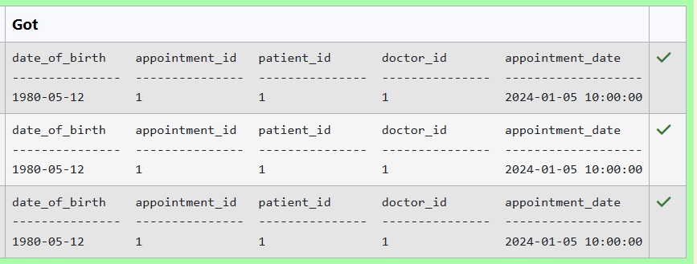

**Question 5**
---
From the following tables write a SQL query to locate those salespeople who do not live in the same city where their customers live and have received a commission of more than 12% from the company. Return Customer Name, customer city, Salesman, salesman city, commission.  

Sample table: customer
<pre>
 customer_id |   cust_name    |    city    | grade | salesman_id 
-------------+----------------+------------+-------+-------------
        3002 | Nick Rimando   | New York   |   100 |        5001
        3007 | Brad Davis     | New York   |   200 |        5001
        3005 | Graham Zusi    | California |   200 |        5002
        3008 | Julian Green   | London     |   300 |        5002
        3004 | Fabian Johnson | Paris      |   300 |        5006
        3009 | Geoff Cameron  | Berlin     |   100 |        5003
        3003 | Jozy Altidor   | Moscow     |   200 |        5007
        3001 | Brad Guzan     | London     |       |        5005
</pre>
Sample table: salesman
<pre>
 salesman_id |    name    |   city   | commission 
-------------+------------+----------+------------
        5001 | James Hoog | New York |       0.15
        5002 | Nail Knite | Paris    |       0.13
        5005 | Pit Alex   | London   |       0.11
        5006 | Mc Lyon    | Paris    |       0.14
        5007 | Paul Adam  | Rome     |       0.13
        5003 | Lauson Hen | San Jose |       0.12
</pre>
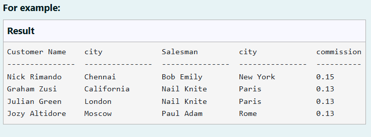
```sql
SELECT 
    c.cust_name AS "Customer Name", 
    c.city AS "city", 
    s.name AS "Salesman", 
    s.city AS "city", 
    s.commission
FROM 
    customer c
JOIN 
    salesman s ON c.salesman_id = s.salesman_id
WHERE 
    c.city != s.city 
    AND s.commission > 0.12;

```

**Output:**


**Question 6**
---
Write the SQL query that achieves the selection of the "cust_name" column from the "customer" table (aliased as "c"), with a left join on the "customer_id" column.
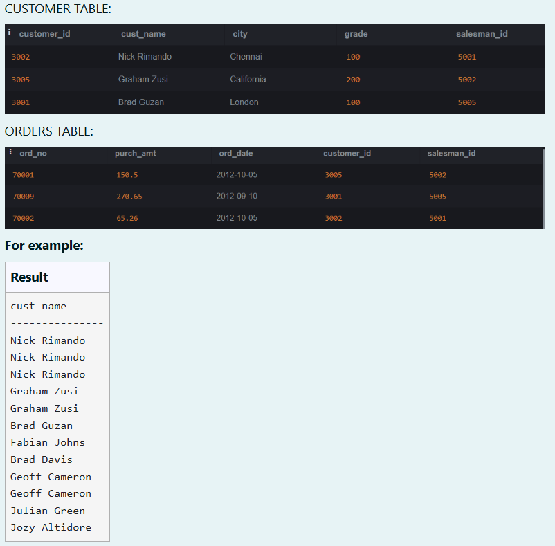

```sql
SELECT 
    c.cust_name
FROM 
    customer AS c
LEFT JOIN 
    orders AS o 
ON 
    c.customer_id = o.customer_id;

```

**Output:**

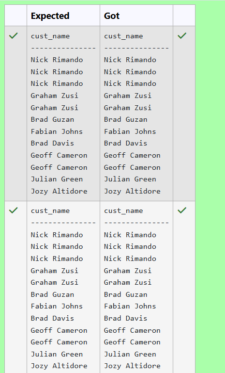

**Question 7**
---
 From the following tables write a SQL query to find the salesperson(s) and the customer(s) he represents. Return Customer Name, city, Salesman, commission.

Sample table: customer
<pre>
 customer_id |   cust_name    |    city    | grade | salesman_id 
-------------+----------------+------------+-------+-------------
        3002 | Nick Rimando   | New York   |   100 |        5001
        3007 | Brad Davis     | New York   |   200 |        5001
        3005 | Graham Zusi    | California |   200 |        5002
        3008 | Julian Green   | London     |   300 |        5002
        3004 | Fabian Johnson | Paris      |   300 |        5006
        3009 | Geoff Cameron  | Berlin     |   100 |        5003
        3003 | Jozy Altidor   | Moscow     |   200 |        5007
        3001 | Brad Guzan     | London     |       |        5005
</pre>
Sample table: salesman
<pre>
 salesman_id |    name    |   city   | commission 
-------------+------------+----------+------------
        5001 | James Hoog | New York |       0.15
        5002 | Nail Knite | Paris    |       0.13
        5005 | Pit Alex   | London   |       0.11
        5006 | Mc Lyon    | Paris    |       0.14
        5007 | Paul Adam  | Rome     |       0.13
        5003 | Lauson Hen | San Jose |       0.12
</pre>
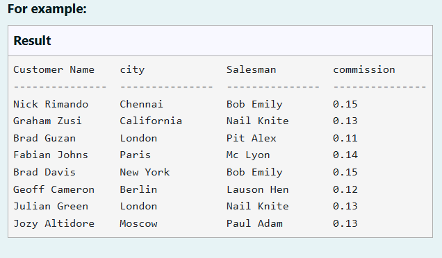
```sql
SELECT 
    c.cust_name AS "Customer Name", 
    c.city AS "city", 
    s.name AS "Salesman", 
    s.commission
FROM 
    customer c
JOIN 
    salesman s ON c.salesman_id = s.salesman_id;

```

**Output:**

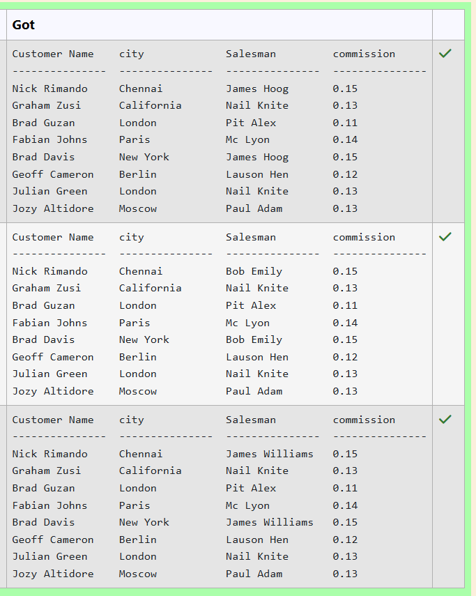

**Question 8**
---
From the following tables write a SQL query to find the details of an order. Return ord_no, ord_date, purch_amt, Customer Name, grade, Salesman, commission. 

Sample table: orders
<pre>
ord_no      purch_amt   ord_date    customer_id  salesman_id
----------  ----------  ----------  -----------  -----------
70001       150.5       2012-10-05  3005         5002
70009       270.65      2012-09-10  3001         5005
70002       65.26       2012-10-05  3002         5001
70004       110.5       2012-08-17  3009         5003
70007       948.5       2012-09-10  3005         5002
70005       2400.6      2012-07-27  3007         5001
70008       5760        2012-09-10  3002         5001
70010       1983.43     2012-10-10  3004         5006
70003       2480.4      2012-10-10  3009         5003
70012       250.45      2012-06-27  3008         5002
70011       75.29       2012-08-17  3003         5007
70013       3045.6      2012-04-25  3002         5001
</pre>
Sample table: customer
<pre>
 customer_id |   cust_name    |    city    | grade | salesman_id 
-------------+----------------+------------+-------+-------------
        3002 | Nick Rimando   | New York   |   100 |        5001
        3007 | Brad Davis     | New York   |   200 |        5001
        3005 | Graham Zusi    | California |   200 |        5002
        3008 | Julian Green   | London     |   300 |        5002
        3004 | Fabian Johnson | Paris      |   300 |        5006
        3009 | Geoff Cameron  | Berlin     |   100 |        5003
        3003 | Jozy Altidor   | Moscow     |   200 |        5007
        3001 | Brad Guzan     | London     |       |        5005
</pre>
Sample table: salesman
<pre>
 salesman_id |    name    |   city   | commission 
-------------+------------+----------+------------
        5001 | James Hoog | New York |       0.15
        5002 | Nail Knite | Paris    |       0.13
        5005 | Pit Alex   | London   |       0.11
        5006 | Mc Lyon    | Paris    |       0.14
        5007 | Paul Adam  | Rome     |       0.13
        5003 | Lauson Hen | San Jose |       0.12
</pre>
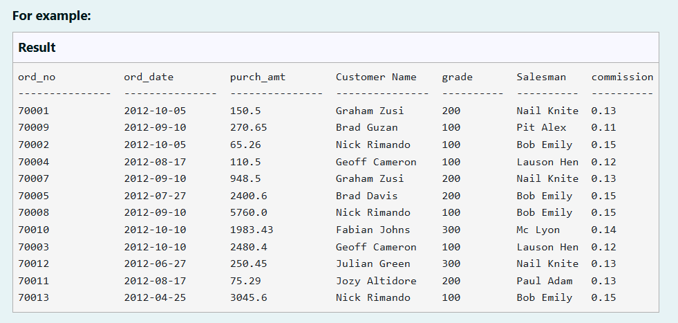
```sql
SELECT 
    o.ord_no, 
    o.ord_date, 
    o.purch_amt, 
    c.cust_name AS "Customer Name", 
    c.grade, 
    s.name AS "Salesman", 
    s.commission
FROM 
    orders o
JOIN 
    customer c ON o.customer_id = c.customer_id
JOIN 
    salesman s ON o.salesman_id = s.salesman_id;

```

**Output:**

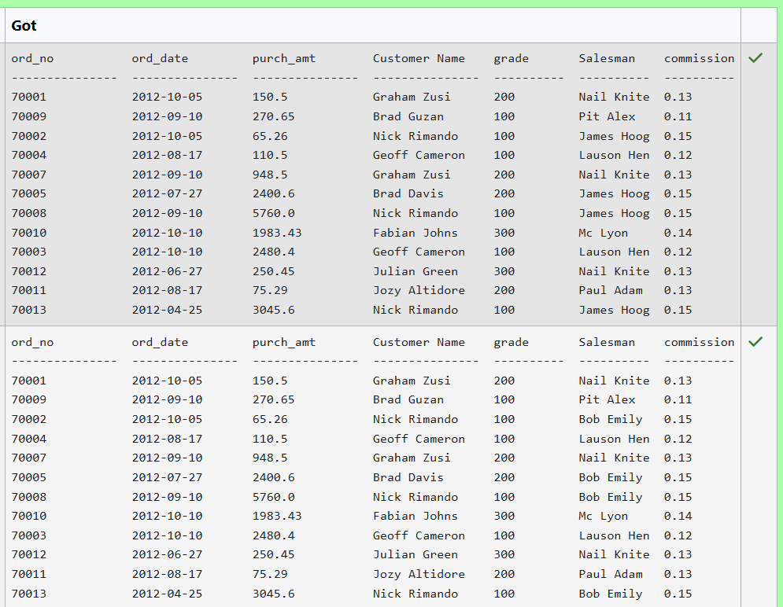

**Question 9**
---
Write the SQL query that achieves the selection of the "name" column from the "salesman" table (aliased as "s"), the "cust_name," "city," "grade," and "salesman_id" columns from the "customer" table (aliased as "c"), with a left join on the "salesman_id" column.
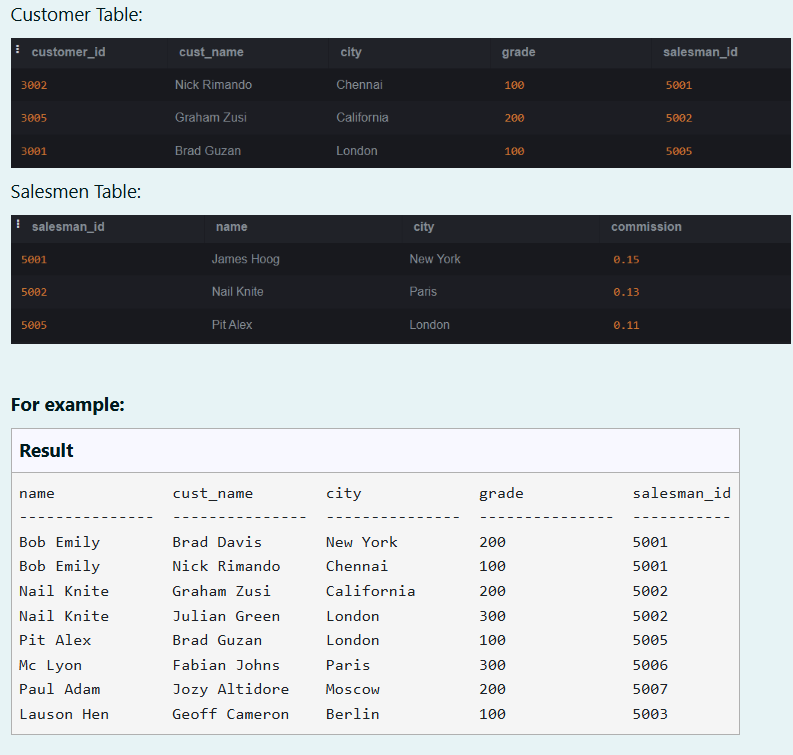

```sql
SELECT 
    s.name, 
    c.cust_name, 
    c.city, 
    c.grade, 
    c.salesman_id
FROM 
    salesman s
LEFT JOIN 
    customer c ON s.salesman_id = c.salesman_id;

```

**Output:**

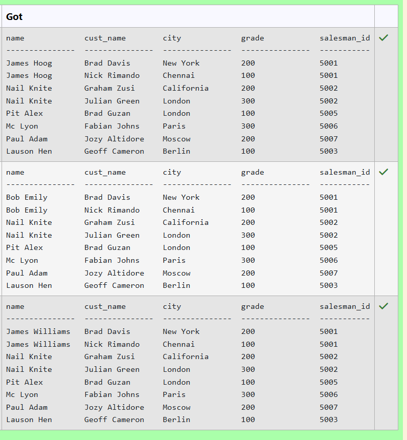

**Question 10**
---
Write the SQL query that achieves the selection of all columns from the "patients" table (aliased as "p"), with an inner join on the "patient_id" column and a condition filtering for appointments with an appointment date between '2024-02-01' and '2024-02-28'.
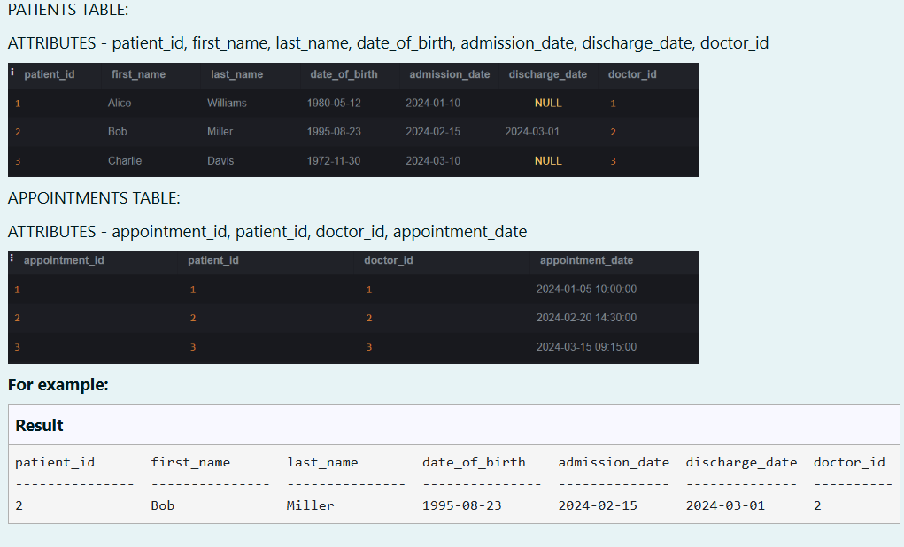

```sql
SELECT p.*
FROM patients AS p
INNER JOIN appointments AS a
    ON p.patient_id = a.patient_id
    AND a.appointment_date BETWEEN '2024-02-01' AND '2024-02-28';

```

**Output:**

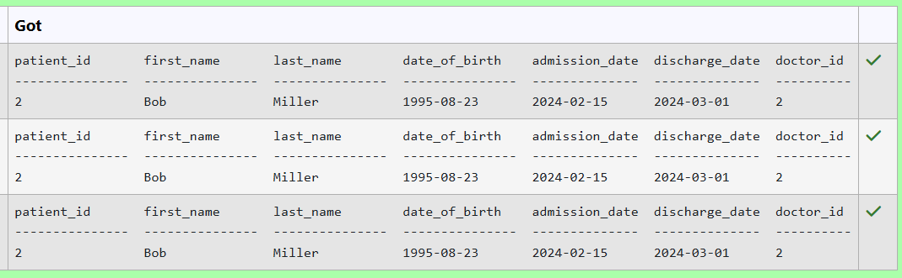


## RESULT
Thus, the SQL queries to implement different types of joins have been executed successfully.
